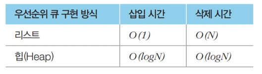
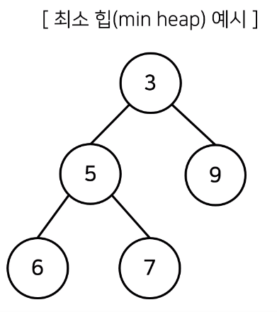
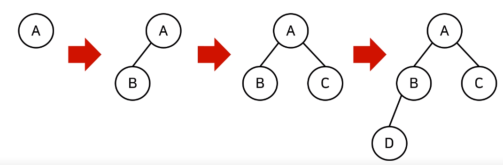
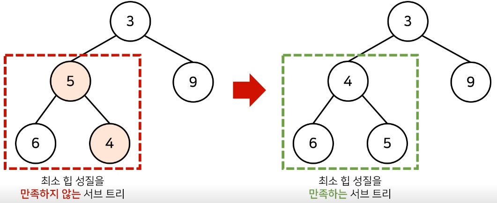
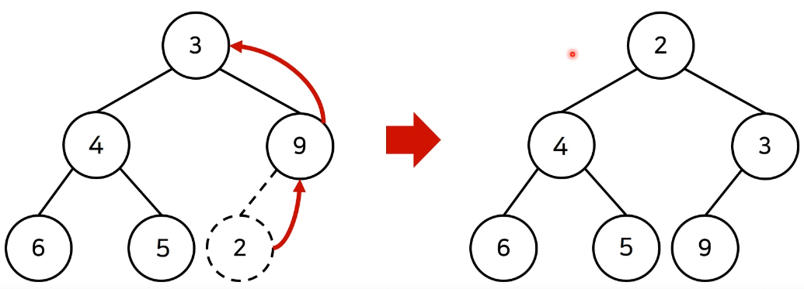
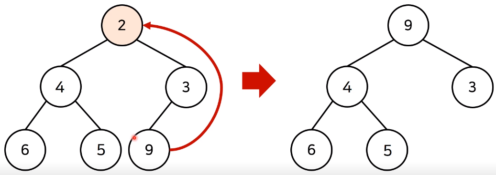
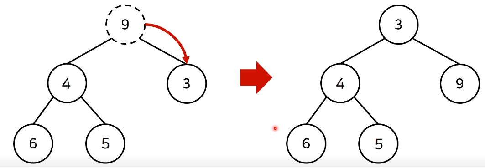

* 스택

* 큐

  * 우선순위 큐
    * 우선순위가 가장 높은 데이터를 가장 먼저 삭제
    * 리스트 로 구현 가능
    * 힙 으로 구현 가능
    * 

* 힙

  * 이진 트리
  * 항상 루트 노드 제거
  * 최소 힙
    * 루트 노드가 가장 작은 값
    * 가장 값이 작은 데이터가 우선 제거 됨
    * 
  * 최대 힙
    * 루트 노드가 가장 큰  값
    * 가장 값이 큰 데이터가 우선 제거 됨

* 완전 이진 트리

  * 루트로 시작 왼쪽 자식 노드, 오른쪽 자식 노드 순서로 차례대로 삽입 되는 트리
  * 

  * 최소 힙 구성 함수
    * 부모 노드로 거슬로러 올라가며, 부모보다 자신의 값이 더 작은 경우에 위치를 교체
    * 
  * 힙에 새로운 원소가 삽입될때
    * 새로운 원소가 삽입되었을 때 O(logN)의 시간 복잡도로 힙 성질을 유지 하도록 할 수 있다
    * 
  * 힙에서 원소가 제거될때
    * 원소가 제거되었을때 O(logN)의 시간 복잡도로 힙 성질을 유지 하도록 할 수 있다
    * 원소를 제거할 때는 가장 마지막 노드가 루트 노드의 위치에 오도록 한다
    * 

